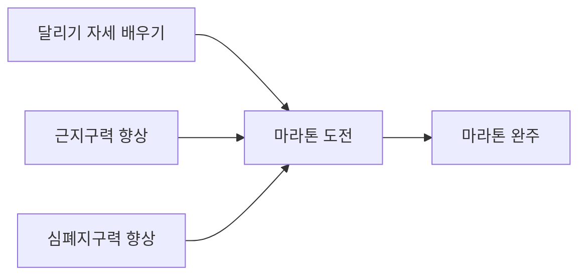

## 기본 개념

크로키는 (일반적으로) 실력을 빠르게 키우는 한 방법입니다. 예술 작품을 완성하는 과정이 아닙니다. 이 말의 의미를 반드시 알고 넘어가야 합니다.

## 실전과 연습의 차이 (Performance vs. Improvement)

실전과 연습의 차이를 정확히 알기는 쉽지 않습니다. 많은 사람들은 일정 수준에 다다르면 더 이상 실력이 늘지 않게 되는데, 대부분 이 차이를 구분하지 못하기 때문입니다.

예시를 들어보겠습니다:

### 마라톤 선수 (평가를 대하는 자세) 

마라톤 완주를 하려는 선수가 있습니다. 그렇다면 실력의 향상 과정은:

순서가 됩니다. 그런데 만일 각 준비 과정부터 과도한 평가에 시달린다면 큰 스트레스를 받을 것이며, 마라톤을 포기하게 될 수도 있습니다.

그림 연습에 있어서도 마찬가지입니다. 단지 눈코입을 연습하는 기초 과정에 불과한데도 선과 형태의 사소한 실수를 일일히 평가내리면서 스트레스에 시달리는 경우가 아주 많습니다.

여기서 "평가"의 개념을 생각해 보아야 합니다. 그림을 잘 그리려면 실수하는 부분이 무엇인지를 알아야하고, 그것을 알려면 실제로 실수를 저질러야하고, 저지른 그 실수를 인지하고, 발전할 방법을 찾아야 합니다. 이 과정 속에서 당연히 잘하거나 못한다는 판단이 들어갈 수 밖에는 없습니다. 하지만 이 과정은 합격이나 성공을 판단하는 "평가"가 아닙니다. 단지 "이 부분이 잘못되었구나"를 인지하는 것입니다.

### 외과 의사 (도전을 대하는 자세)

의사는 살아있는 환자의 몸에 갑자기 새로운 기술을 연습해서는 안됩니다. 수술을 집도할 때에는 지금까지 쌓아온 경험과 노하우를 총동원해서 환자를 살리겠다는 목적에 집중해야 합니다.

하지만 새로운 의학기술이나 치료법을 대할 때에는 똑같은 자세를 가질 수는 없습니다. 지금까지의 경험도 중요하지만 새로운 것을 배우고 연습해야만 합니다.

그림도 마찬가지입니다. 크로키는 단지 수술 방식의 연구 과정일 뿐입니다. 얼마든지 새로운 시도를 해보고 실패하거나 틀릴 수도 있습니다.오히려 그게 크로키의 목적입니다.

## 목적 이해하기

무엇을, 왜, 어떻게 그리는지를 정확히 이해해야 합니다.

### 무엇을

> "이 사람의 팔을 그려야지" 보다는 "이 사람의 팔꿈치 접히는 부분, 특히 소매가 구겨지는 모습을 그려야지." 라고 생각하면 좋습니다.

> "이 사람의 얼굴을 그려야지" 보다는 "찡그린 표정에서 분노가 느껴지는데, 그 이유가 무엇일까, 미간에 생긴 주름 때문일까? 아니면 입의 형태 때문일까? 그 분위기를 알아봐야겠다." 가 더 좋습니다.

### 왜

> 관절을 구형으로 표현하라는 조언을 듣고, 그것을 시도해 볼 때, 그 선택으로 어떤 장점과 단점이 있고, 어떤 것을 배우게 되었는지를 늘 연구해야 합니다.
> 
> 단지 "구형을 그리면 더 잘 되는 것 같아서"로는 부족합니다. "구형으로 관절을 표현했더니 숨겨진 신체부위를 상상하기가 쉬워지고, 그 결과 자세가 자연스러워졌구나, 그렇다면 나는 신체가 가려지면 어떤 형태가 되어 있을지에 대한 이해가 부족하구나."

### 어떻게

### 지우개를 안 쓰는 이유

선을 한 번에 긋는 연습은 관찰한 것을 정확히 그려낼 수 있는지를 시험해 보는 과정입니다. 지우개를 허용한다면 어차피 지우면 된다는 마음에 빠지게 되고, 그러면 "마음 속으로 결정한 선"을 그리는 것이 아니라, "일단 종이에 그려보고, 그 다음 사진과 비교해보고, 틀렸으니 수정하는" 방식이 됩니다.

-- 만약 사진을 처음에만 본 뒤 그 기억을 토대로 처음부터 끝까지 그린 다음 오류를 비교, 너무 힘들다 -> 그렇다면 그리고 비교하는 과정을 잘게 쪼개는 것. 하지만 매 선을 비교하게 되면 큰 그림을 보지 못하게 되고, 단지 실루엣이나 작은 부분만을 옮겨내기에만 집중하게 된다.

### 틀리기

틀려야 문제점을 알 수 있고, 틀린 이유를 연구해야 그 문제를 극복할 수 있습니다.

### 첫번째 초보자의 실수 : 안 틀리기