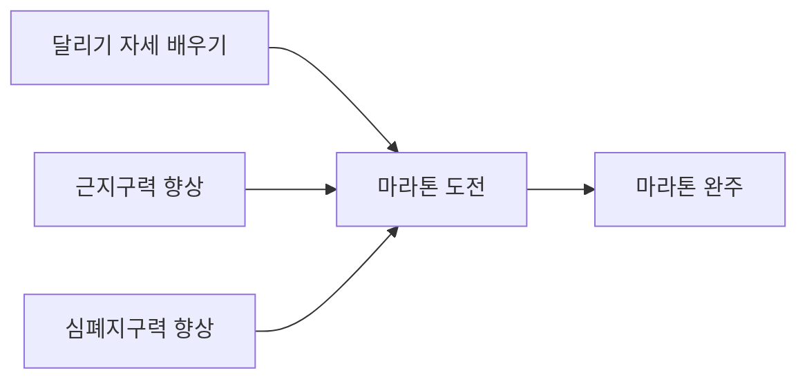

## 기본 개념

크로키는 (일반적으로) 실력을 빠르게 키우는 한 방법입니다. 예술 작품을 완성하는 과정이 아닙니다. 이 말의 의미를 반드시 알고 넘어가야 합니다.

## 실전과 연습의 차이 (Performance vs. Improvement)

실전과 연습의 차이를 정확히 알기는 쉽지 않습니다. 많은 사람들은 일정 수준에 다다르면 더 이상 실력이 늘지 않게 되는데, 대부분 이 차이를 구분하지 못하기 때문입니다.

예시를 들어보겠습니다:

### 마라톤 선수 (평가를 대하는 자세) 

마라톤 완주를 하려는 선수가 있습니다. 그렇다면 실력의 향상 과정은:

순서가 됩니다. 그런데 세발자전거를 연습하는 순간부터 심사위원의 평가에 시달린다면 어떨까요? 결국 공중 3회전만 잘 해내면 되는데도, 세발자전거를 완벽하게 타야만 하는 압박감에 큰 스트레스를 받을 것입니다.

그 심사위원이 스스로의 마음 속에 있을 수도 있습니다. 당신의 목표는 멋진 인물화를 그려내는 것입니다. 만일 공모전에 제출한다면 심사위원의 평가에 스트레스를 받을 수도 있습니다. 그런데 지금은 눈코입의 형상을 연습하는 기초 과정에 불과한데도, 마치 심사위원들이 선과 형태를 일일히 평가내리고 비판하는 듯한 스트레스에 시달리는 사람들이 아주 많습니다.

물론 아무런 생각 없이 연습을 해서도 안되지만, 지금의 과정은 향후 해내고 싶은 목표에 도달하는 과정임을 정확히 인지하고, 틀리거나 실수하더라도 과정의 일부분임을 알아야만 합니다.

그렇지 않으면 공중 3회전에 다다르기도 전에 자전거 타기를 애초부터 포기하게 될 수 있습니다. 이렇게 포기하는 사람이 아주 많습니다. 이같은 실수에 빠지지 않도록 주의해야 합니다.

### 외과의사의 수술 집도 (도전을 대하는 자세)

의사는 살아있는 환자의 몸에 갑자기 새로운 기술을 연습해서는 안됩니다. 수술을 집도할 때에는 지금까지 쌓아온 경험과 노하우를 총동원해서 환자를 살리겠다는 목적에 집중해야만 합니다.

하지만 새로운 의학기술이나 치료법을 대할 때에도 똑같은 자세를 유지한다면 어떨까요? 지금까지의 경험만 믿고 아무런 도전을 하지 않는다면, 더 뛰어난 수술을 해낼 수는 없습니다.

크로키도 동일한 원리가 적용됩니다. 크로키는 진짜 수술(예술 작품 완성)이 아니라 단지 수술 방식의 연구 과정입니다. 얼마든지 새로운 시도를 해보고 과감히 실패하거나 틀려도 좋습니다. 그게 크로키의 목적입니다.

## 목적 이해하기

무엇을, 왜, 어떻게 그리는지를 정확히 이해해야 합니다.

> "이 사람의 팔을 그려야지" 보다는 "이 사람의 팔꿈치 접히는 부분, 특히 소매가 구겨지는 모습을 그려야지." 라고 생각하면 좋습니다.

> "이 사람의 얼굴을 그려야지" 보다는 "찡그린 표정에서 분노가 느껴지는데, 그 이유가 무엇일까, 미간에 생긴 주름 때문일까? 아니면 입의 형태 때문일까? 그 분위기를 따라해봐야겠다." 가 더 좋습니다.

어떤 방식을 "왜" 사용하는지 또한 마찬가지입니다.

> 관절을 구형으로 표현하라는 조언을 듣고, 그것을 시도해 볼 때, 그 선택으로 어떤 장점과 단점이 있고, 어떤 것을 배우게 되었는지를 늘 연구해야 합니다.

> 단지 "구형을 그리면 더 잘 되는 것 같아서"로는 부족합니다. "구형으로 관절을 표현했더니 숨겨진 신체부위를 상상하기가 쉬워지고, 그 결과 자세가 자연스러워졌구나, 그렇다면 나는 신체가 가려지면 어떤 형태가 되어 있을지를 굳이 그리지 않고도 상상만으로 정확히 그려내는 연습이 필요하겠구나." -> "그렇다면 이번에는 가려진 팔이나 다리 부분을 신경써서 그려봐야겠다"

### 지우개를 안 쓰는 이유

선을 한 번에 그어야만 하는 이유는 관찰한 것을 정확히 그려내야만 하기 때문입니다. 지우개를 허용한다면 어차피 지우면 된다는 마음에 빠지게 되고, 그러면 "마음 속으로 결정한 선"을 그리는 것이 아니라, "일단 종이에 그려보고, 그 다음 사진과 비교해보고, 틀렸으니 수정하는" 방식이 됩니다.

만약 사진을 처음에만 본 뒤 그 기억을 토대로 처음부터 끝까지 그린 다음 오류를 비교, 너무 힘들다 -> 그렇다면 그리고 비교하는 과정을 잘게 쪼개는 것. 하지만 매 선을 비교하게 되면 큰 그림을 보지 못하게 되고, 단지 실루엣이나 작은 부분만을 옮겨내기에만 집중하게 된다.

### 틀리기

틀려야 문제점을 알 수 있고, 틀린 이유를 연구해야 그 문제를 극복할 수 있습니다.

### 첫번째 초보자의 실수 : 안 틀리기